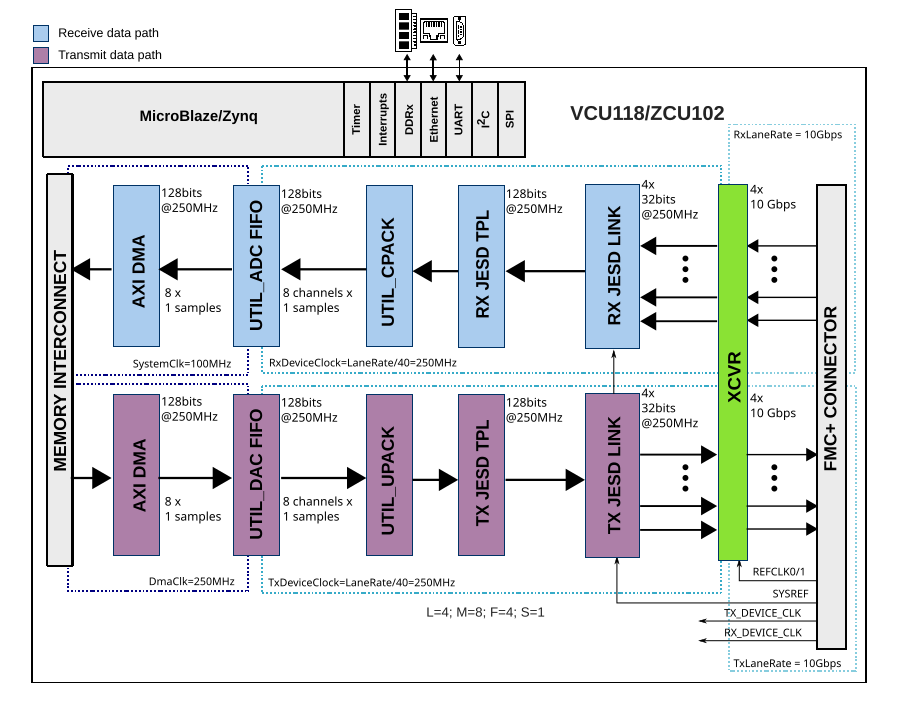

.. _ad9081 radar:

gr-ofdmradar - OFDM Radar on MxFE Platforms
===============================================================================

This documentation covers building an OFDM radar system on a ZCU102 + AD9081
using GNU Radio and IIO.

Software/Hardware quickstart
-------------------------------------------------------------------------------

Required hardware
~~~~~~~~~~~~~~~~~~~~~~~~~~~~~~~~~~~~~~~~~~~~~~~~~~~~~~~~~~~~~~~~~~~~~~~~~~~~~~~

- :xilinx:`Zynq UltraScale+ MPSoC ZCU102 Evaluation Kit <products/boards-and-kits/ek-u1-zcu102-g.html>`
- :adi:`AD9081 Evaluation Board <EVAL-AD9081>`
- TX and RX antennas with cables
- Optional RF components (receiver LNA, TX PA)
- Linux development machine (x86_64)

Required software
~~~~~~~~~~~~~~~~~~~~~~~~~~~~~~~~~~~~~~~~~~~~~~~~~~~~~~~~~~~~~~~~~~~~~~~~~~~~~~~

- Vivado 2020.2+ (with Vitis SDK)
- MPSoC license (included with eval kit)
- Recent software build toolchain

Preparing ZCU102 boot files
~~~~~~~~~~~~~~~~~~~~~~~~~~~~~~~~~~~~~~~~~~~~~~~~~~~~~~~~~~~~~~~~~~~~~~~~~~~~~~~

**Installing Kuiper Linux**

Recommended starting point: recent
:external+kuiper:doc:`Kuiper Linux <index>` image on SD card.

**Linux Kernel Build**

.. code-block:: bash

   git clone https://github.com/analogdevicesinc/linux.git
   cd linux

   export PATH=$PATH:/opt/Xilinx/Vitis/2020.2/gnu/aarch64/lin/aarch64-linux/bin/
   export ARCH=arm64
   export CROSS_COMPILE=aarch64-linux-gnu-

   make adi_zynqmp_defconfig
   make -j$(nproc) Image UIMAGE_LOADADDR=0x8000
   cp arch/arm64/boot/Image /mnt/boot/

**Device Tree Blob Build**

.. code-block:: bash

   make xilinx/zynqmp-zcu102-rev10-ad9081-m8-l4-tdd.dtb
   cp arch/arm64/boot/dts/xilinx/zynqmp-zcu102-rev10-ad9081-m8-l4-tdd.dtb /mnt/boot/system.dtb

.. note::

   Device tree blob MUST be renamed to ``system.dtb``.

Building the HDL
~~~~~~~~~~~~~~~~~~~~~~~~~~~~~~~~~~~~~~~~~~~~~~~~~~~~~~~~~~~~~~~~~~~~~~~~~~~~~~~

.. code-block:: bash

   source /opt/Xilinx/Vivado/2020.2/settings64.sh
   git clone https://github.com/Yamakaja/hdl.git
   git switch data_offload

   cd projects/ad9081/ad9081_fmca_ebz/zcu102/
   make TDD_SUPPORT=1 SHARED_DEVCLK=1

Build duration is typically 15-30 minutes.

Output: ``projects/ad9081_fmca_ebz/zcu102/ad9081_fmca_ebz_zcu102.sdk/system_top.xsa``

See the `Build Zynq UltraScale+ Boot Image guide <https://developer.analog.com/docs/system-level/linux/kernel/zynqmp/>`_
for creating ``BOOT.BIN``.

Building GNU Radio
~~~~~~~~~~~~~~~~~~~~~~~~~~~~~~~~~~~~~~~~~~~~~~~~~~~~~~~~~~~~~~~~~~~~~~~~~~~~~~~

Repository: `Yamakaja/gnuradio <https://github.com/Yamakaja/gnuradio>`_
feature/gr-iio-tdd branch.

.. code-block:: bash

   git clone https://github.com/Yamakaja/gnuradio.git
   git switch feature/gr-iio-tdd

   mkdir -p build
   cmake -DCMAKE_INSTALL_PREFIX=/usr/local \
       -DPYTHON_EXECUTABLE=$(which python3) \
       -DPYTHON_INCLUDE_DIR=/usr/include/python3.9 \
       -DPYTHON_LIBRARY=/usr/lib/libpython3.9.so \
       -DGR_PYTHON_DIR=/usr/lib/python3.9/site-packages \
       -DENABLE_GRC=ON \
       -DENABLE_GR_QTGUI=ON \
       -DQWT_LIBRARIES=/usr/lib/libqwt.so \
       -DCMAKE_BUILD_TYPE=Debug \
       -B build \
       -S .

   make -C build -j$(nproc)
   sudo make -C build install

   LD_LIBRARY_PATH=/usr/local/lib /usr/local/bin/gnuradio-companion

Building gr-ofdmradar
~~~~~~~~~~~~~~~~~~~~~~~~~~~~~~~~~~~~~~~~~~~~~~~~~~~~~~~~~~~~~~~~~~~~~~~~~~~~~~~

.. code-block:: bash

   git clone https://github.com/analogdevicesinc/gr-ofdmradar.git
   cd gr-ofdmradar

   mkdir -p build
   cmake -DCMAKE_INSTALL_PREFIX=/usr/local \
       -DPYTHON_EXECUTABLE=$(which python3) \
       -DPYTHON_INCLUDE_DIR=/usr/include/python3.9 \
       -DPYTHON_LIBRARY=/usr/lib/libpython3.9.so \
       -DGR_PYTHON_DIR=/usr/lib/python3.9/site-packages \
       -DCMAKE_BUILD_TYPE=Debug \
       -B build \
       -S .

   make -C build
   sudo make -C build install

   LD_LIBRARY_PATH=/usr/local/lib /usr/local/bin/gnuradio-companion

Testing the OFDM Radar
~~~~~~~~~~~~~~~~~~~~~~~~~~~~~~~~~~~~~~~~~~~~~~~~~~~~~~~~~~~~~~~~~~~~~~~~~~~~~~~

**Simulation testing**

Launch ``ofdmradar_test`` example from gr-ofdmradar examples directory.
This simulates four radar targets.

.. figure:: images/radar_ofdmradar-simulation-flowgraph.png
   :align: center

   OFDM radar simulation flowgraph

.. figure:: images/radar_ofdmradar-simulation-screen.png
   :align: center

   Radar display with four target echoes

**Hardware testing (ZCU102/AD9081)**

Open ``ofdmradar_ad9081.grc`` flowgraph in gr-ofdmradar examples.
Set ``iio_target`` variable to ZCU102 IP address.

.. warning::

   Default configuration may violate local RF regulations; verify band
   allocation and power limits.

.. figure:: images/radar_ofdmradar-ad9081-flowgraph.png
   :align: center

   AD9081 OFDM radar flowgraph

Test result: Successful detection at approximately 35-meter range.

Useful resources
~~~~~~~~~~~~~~~~~~~~~~~~~~~~~~~~~~~~~~~~~~~~~~~~~~~~~~~~~~~~~~~~~~~~~~~~~~~~~~~

- `Martin Braun's dissertation on OFDM radar theory <https://publikationen.bibliothek.kit.edu/1000038892>`_
- `gr-ofdmradar README <https://github.com/analogdevicesinc/gr-ofdmradar/blob/master/README.md>`_
- `GNU Radio AD9081 branch <https://github.com/Yamakaja/gnuradio/tree/feature/gr-iio-tdd>`_
- `gr-ofdmradar repository <https://github.com/analogdevicesinc/gr-ofdmradar>`_

Using the OFDM Radar
-------------------------------------------------------------------------------

System parameters
~~~~~~~~~~~~~~~~~~~~~~~~~~~~~~~~~~~~~~~~~~~~~~~~~~~~~~~~~~~~~~~~~~~~~~~~~~~~~~~

.. figure:: images/radar_gr_ofdmradar_sysparams.png
   :align: center

   OFDM radar system parameters

Example parameters:

- Complex system sample rate: ``f_s = 250 MS/s``
- FFT Size: ``N = 4096``
- Frame symbols: ``M = 16``
- Cyclic prefix length: ``N_CP = 256``
- Nyquist guard carriers: ``N_NG = 64``

Derived calculations:

- **Total TX frame length**: ``L = (N+N_CP)*M = 69,632 samples``
- **Frame duration**: ``T = L / f_s = 279 microseconds``
- **Time domain resolution** (non-oversampled): Approximately 60 centimeters
- **Doppler resolution** (non-oversampled): ``f_s / ((N+N_CP)*M) = 3,590 Hz``
- **True system bandwidth**: ``B = (N - 2*N_NG)/N * f_s = 242.2 MHz``
- **Processing gain**: ``G = 10 * log10(N * M) ≈ 48 dB``
- **Maximum unambiguous distance**: ``d = N_CP*c / (4*f_s) ≈ 77 meters``

Flowgraph parameters
~~~~~~~~~~~~~~~~~~~~~~~~~~~~~~~~~~~~~~~~~~~~~~~~~~~~~~~~~~~~~~~~~~~~~~~~~~~~~~~

.. figure:: images/radar_gr_ofdmradar_sysparams_annotated.png
   :align: center

   Annotated system parameters

**buffer_size**

Specifies samples the receiver accepts per frame. Should equal or exceed
frame length ``L``. Controls IIO buffer alignment.

**amplitude**

Controls transmit power via pre-multiplication. Due to processing gain,
required transmit power may be low.

**t_0**

TDD engine offset between transmission start and recording start. Requires
calibration for accurate range determination.

**display_mult**

Post-processing scaling for return signal intensity visualization. Does NOT
affect receiver sensitivity.

Visualization parameters
~~~~~~~~~~~~~~~~~~~~~~~~~~~~~~~~~~~~~~~~~~~~~~~~~~~~~~~~~~~~~~~~~~~~~~~~~~~~~~~

.. figure:: images/radar_gr_ofdmradar_screen.png
   :align: center

   Radar visualization screen

**Range Slider**

Controls displayed range; functions as inverted zoom (left movement = zoomed
range view).

**Doppler Range Slider**

Reduces displayed doppler ranges similarly.

**min/max Value Sliders**

Map energy values to visualization using mapping function:

.. code-block::

   mapv(x) = (x - minV) / (maxV - minV)
   return max(min(x, 1.0), 0.0)

Processing pipeline:

#. Calculate energy from complex 2D matrix (range × doppler)
#. Apply mapping function with min/max scaling
#. Pass through turbo colormap
#. Display on screen

See `screen fragment shader code <https://github.com/analogdevicesinc/gr-ofdmradar/blob/master/lib/resources/screen.frag>`_.

System deep dive
-------------------------------------------------------------------------------

Overview
~~~~~~~~~~~~~~~~~~~~~~~~~~~~~~~~~~~~~~~~~~~~~~~~~~~~~~~~~~~~~~~~~~~~~~~~~~~~~~~

This section covers system architecture from transceiver through signal
processing:

- Transceiver/RF ADC/DAC (AD9081)
- Hardware/HDL implementation
- Linux drivers
- gr-ofdmradar signal processing blocks

ZCU102/AD9081 platform
~~~~~~~~~~~~~~~~~~~~~~~~~~~~~~~~~~~~~~~~~~~~~~~~~~~~~~~~~~~~~~~~~~~~~~~~~~~~~~~

The :adi:`AD9081` is a 4-channel RF DAC/ADC in single package.

Key features:

- Multi-chip synchronization support
- JESD 204B/C data interface
- 8+8 SERDES lanes (RX+TX)

.. note::

   ZCU102 transceivers maximum speed is ~15 Gbps, so only JESD 204B operation
   is available (not 204C).

Problem statement
~~~~~~~~~~~~~~~~~~~~~~~~~~~~~~~~~~~~~~~~~~~~~~~~~~~~~~~~~~~~~~~~~~~~~~~~~~~~~~~

**Pulse Radar Time-of-Flight Challenge**

.. figure:: images/radar_pulse_radar.png
   :align: center

   Pulse radar concept

Monostatic radar requires known, fixed timing relationship between transmit
and receive to calculate distance via time-of-flight measurement.

**Data Rate Bottleneck**

Default ZCU102/AD9081 configuration:

- Active channels: 4 RX + 4 TX @ 250 MS/s
- Sample format: 32-bit complex (16+16 bit)
- Data rate per direction: ``4 × 250e6 MS/s × 32 bit/sample = 32 Gbps``

.. figure:: images/radar_system_link_rates.png
   :align: center

   System link rate limitations

System link limitations:

- Memory links: Can handle rates
- FPGA: Can handle rates
- Processing system: Cannot handle rates
- Gigabit Ethernet: Cannot handle rates

**IIO Buffer Guarantees**

Provided:

- Samples within single buffer play as continuous stream
- Buffers maintain order (no reordering)

Problem: Without modifications, RX/TX timing relationship is random.

.. figure:: images/radar_iio_buffers_unaligned.png
   :align: center

   IIO buffers unaligned state

Default scenario: RX and TX buffers sample independently with unpredictable
spacing.

**Solution: Time Division Duplexing with Data Offload**

Hardware-controlled windowing of transmit/receive signals at predetermined
times (oscilloscope-like triggering).

Result:

- Reduced data rates in controlled manner
- Known timing relationships between RX/TX

.. figure:: images/radar_iio_buffers_aligned.png
   :align: center

   IIO buffers aligned state

The HDL
~~~~~~~~~~~~~~~~~~~~~~~~~~~~~~~~~~~~~~~~~~~~~~~~~~~~~~~~~~~~~~~~~~~~~~~~~~~~~~~

HDL changes are in a development branch:
`Yamakaja/hdl data_offload branch <https://github.com/Yamakaja/hdl/tree/data_offload>`_.

**TDD (Time Division Duplexing) Core**

Originally developed for AD9361 transceiver family. See
`AXI TDD IP core documentation <https://developer.analog.com/docs/hdl/library/axi_tdd/>`_.

The AXI_TDD wrapper exposes TDD IP core as standalone module. All channels
function independently.

**Data Offload Engine**

Acts as glorified FIFO triggered by TDD engine for sampling data streams.

Key features:

- Multiple configuration options
- Synchronization modes for waiting state
- Triggered operation (register write or external signal)

See `Data Offload README <https://github.com/Yamakaja/hdl/blob/data_offload/library/data_offload/README.md>`_.

**Integration Architecture**

.. figure:: images/radar_ad9081_zcu102_bd_tdd_do.png
   :align: center

   AD9081 ZCU102 block diagram with TDD and data offload

Signal flow:

- ``tdd_tx_valid`` → TX data offload external sync input
- ``sync_ext`` signal triggers data offload
- External sync signal relevance limited to initial waiting phase
- Can transition LOW immediately after trigger

**TX Data Path**

Once triggered:

#. Data offload fills internal buffer
#. Buffer size must be integer multiple of IIO buffer size
#. Buffer plays back to upack core
#. Unpacker deinterleaves packed samples into parallel bus
#. Output: 2×16 bit per complex channel @ 128-bit, 250 MHz

**RX Data Path Complexity**

Challenge: CPACK core packing format timing asynchrony with TDD sync signal.

Problem scenario:

- Single active channel from four-channel configuration
- CPACK output valid only once per four samples
- CPACK position relative to sync arrival = apparent random shift (0-3 samples)

Current solution: Reset CPACK with every sync signal (not optimal but least
invasive approach).

**JESD Configuration Detail**

   JESD204B M=8, L=4 datapath configuration

Datapath illustration with M=8, L=4 configuration. UTIL_DACFIFO and
UTIL_ADCFIFO replaced by data offloads in actual implementation.

Linux drivers
~~~~~~~~~~~~~~~~~~~~~~~~~~~~~~~~~~~~~~~~~~~~~~~~~~~~~~~~~~~~~~~~~~~~~~~~~~~~~~~

Two primary drivers:

#. Data Offload Driver
#. TDD Driver

**Data Offload Driver**

Location: `drivers/misc/adi-axi-data-offload.c <https://github.com/analogdevicesinc/linux/blob/master/drivers/misc/adi-axi-data-offload.c>`_

Primary functions:

- Configure data offload registers from device tree values
- Provide debugfs runtime register modification interface

Device tree configuration:
`adi,axi-data-offload.yaml <https://github.com/analogdevicesinc/linux/blob/master/Documentation/devicetree/bindings/misc/adi,axi-data-offload.yaml>`_

Integration with DDS driver at
`cf_axi_dds.c <https://github.com/analogdevicesinc/linux/blob/master/drivers/iio/frequency/cf_axi_dds.c>`_
handles cyclic/oneshot operation via data offload.

Use case for repeated radar waveform transmission:

- Data offload cyclic mode with synchronization enabled
- Waits for sync signal before each iteration
- Allows single buffer load with multiple replay iterations

**TDD Driver**

Location: `drivers/iio/adc/cf_axi_tdd.c <https://github.com/analogdevicesinc/linux/blob/master/drivers/iio/adc/cf_axi_tdd.c>`_

Features:

- Static configuration via device tree attributes
- IIO device interface for runtime control

TDD Register Access example:

.. code-block::

   iio:device2: axi-core-tdd
   4 channels found:
     data1 (output/input): 6 channel-specific attributes
       - dp_off_ms
       - dp_on_ms
       - off_ms
       - on_ms
       - vco_off_ms
       - vco_on_ms
     data0 (output/input): 6 channel-specific attributes
       - [Same attributes as data1]

   10 device-specific attributes:
     - burst_count
     - counter_int
     - dma_gateing_mode (options: rx_tx, rx_only, tx_only, none)
     - en
     - en_mode (options: rx_tx, rx_only, tx_only)
     - frame_length_ms
     - secondary
     - sync_terminal_type
     - direct_reg_access (debug)

GNU Radio integration
-------------------------------------------------------------------------------

Two component categories:

#. **Hardware Control Blocks** (gr-iio in-tree)

   - AD9081 Source/Sink
   - TDD Engine Control

#. **Signal Processing Blocks** (gr-ofdmradar)

   - Hardware-independent OFDM radar processing
   - Direction of arrival (DoA) blocks

gnuradio/gr-iio blocks
~~~~~~~~~~~~~~~~~~~~~~~~~~~~~~~~~~~~~~~~~~~~~~~~~~~~~~~~~~~~~~~~~~~~~~~~~~~~~~~

**Operational Model: Bursty Data Assumption**

Working with bursts where one burst = one IIO buffer.

Burst indication: Packet length tags marking buffer boundaries.

Tag format example:

.. code-block::

   [... x-2, x-1, x0, x1, x2, x3, x4, x5, x6, x7, x8, x9, x10, x11, x12, ...]
           ^                                       ^
           |{packet_len: 10}              |{packet_len: 10}

Packet length tags are redundant for same-size IIO buffers but enable
compatibility with variable-size streams.

AD9081 Sink Block: If packet length tag name populated, sink enforces correct
tagging and aborts flowgraph on errors.

**Common Block Attributes**

Shared parameters:

- IIO context URI
- IIO buffer size
- Packet length tag name
- NCO attributes

Source-specific:

- Nyquist Zone (Odd/Even)
- Programmable hardware FIR filter file

Sink-specific:

- Cyclic Mode

**AD9081 Sink Block Configuration**

.. figure:: images/radar_gr_iio_ad9081_sink_general.png
   :align: center

   AD9081 sink general settings

.. figure:: images/radar_gr_iio_ad9081_sink_channels.png
   :align: center

   AD9081 sink channel settings

.. figure:: images/radar_gr_iio_ad9081_sink_coarse_duc.png
   :align: center

   AD9081 sink coarse DUC settings

.. figure:: images/radar_gr_iio_ad9081_sink_fine_duc.png
   :align: center

   AD9081 sink fine DUC settings

**AD9081 Source Block Configuration**

.. figure:: images/radar_gr_iio_ad9081_source_general.png
   :align: center

   AD9081 source general settings

.. figure:: images/radar_gr_iio_ad9081_source_coarse_ddc.png
   :align: center

   AD9081 source coarse DDC settings

Frequency calculation uses ``gr.nyquist_fold()`` function to calculate NCO
frequencies accounting for aliasing and spectral inversion.

**TDD Control Block**

Stream IO: None

Purpose: Convenient access to underlying IIO attributes.

.. figure:: images/radar_gr_iio_tdd_general.png
   :align: center

   TDD control general settings

.. figure:: images/radar_gr_iio_tdd_primary_timing.png
   :align: center

   TDD control primary timing settings

gr-ofdmradar signal processing blocks
~~~~~~~~~~~~~~~~~~~~~~~~~~~~~~~~~~~~~~~~~~~~~~~~~~~~~~~~~~~~~~~~~~~~~~~~~~~~~~~

Block categories:

#. OFDM Radar blocks (TX, RX, GUI)
#. Direction of Arrival (DoA) blocks

**OFDM Radar System Parameters Block**

.. figure:: images/radar_gr_ofdmradar_params.png
   :align: center

   OFDM radar parameters block

Purpose: Store shared system parameters for TX, RX, GUI blocks.

**OFDM Radar Transmitter Block**

.. figure:: images/radar_gr_ofdmradar_tx.png
   :align: center

   OFDM radar TX block

Inputs: System parameters, length tag key.

Output: Full OFDM radar frame, length-tagged for AD9081 sink compatibility.

**OFDM Radar Receiver Block**

.. figure:: images/radar_gr_ofdmradar_rx.png
   :align: center

   OFDM radar RX block

Inputs: System parameters, length tag key, buffer size.

``buffer_size`` parameter:

- Specifies expected samples per OFDM frame
- Actual processing determined by OFDM parameters
- Allows discarding additional samples for IIO buffer alignment
- Discarded samples: ``buffer_size - radar_params.frame_length``

**OFDM Radar GUI Block**

.. figure:: images/radar_gr_ofdmradar_gui.png
   :align: center

   OFDM radar GUI block

Inputs: OFDM radar parameters, GUI hint.

Purpose: Real-time radar display with range/doppler visualization.

Direction of Arrival (DoA) blocks
~~~~~~~~~~~~~~~~~~~~~~~~~~~~~~~~~~~~~~~~~~~~~~~~~~~~~~~~~~~~~~~~~~~~~~~~~~~~~~~

**DoA Autocorrelator Block**

.. figure:: images/radar_gr_ofdmradar_doa_corr.png
   :align: center

   DoA autocorrelator block

Purpose: Compute correlation matrices from multi-channel receiver data.

**DoA Calibration Block**

.. figure:: images/radar_gr_ofdmradar_doa_cal.png
   :align: center

   DoA calibration block

Purpose: Calibrate antenna array responses.

**DoA MUSIC Estimator Block**

.. figure:: images/radar_gr_ofdmradar_doa_music.png
   :align: center

   DoA MUSIC estimator block

Algorithm: MUSIC (Multiple Signal Classification) for direction estimation.

**DoA ESPRIT Estimator Block**

.. figure:: images/radar_gr_ofdmradar_doa_esprit.png
   :align: center

   DoA ESPRIT estimator block

Algorithm: ESPRIT (Estimation of Signal Parameters via Rotational Invariance
Techniques).

**DoA Block Assumptions**

Implicit assumptions:

- Linear antenna array topology
- Lambda/2 carrier wavelength spacing

Primary parameters:

- Number of expected targets
- Number of receiver channels
